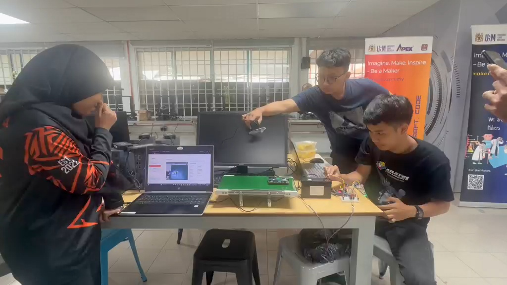
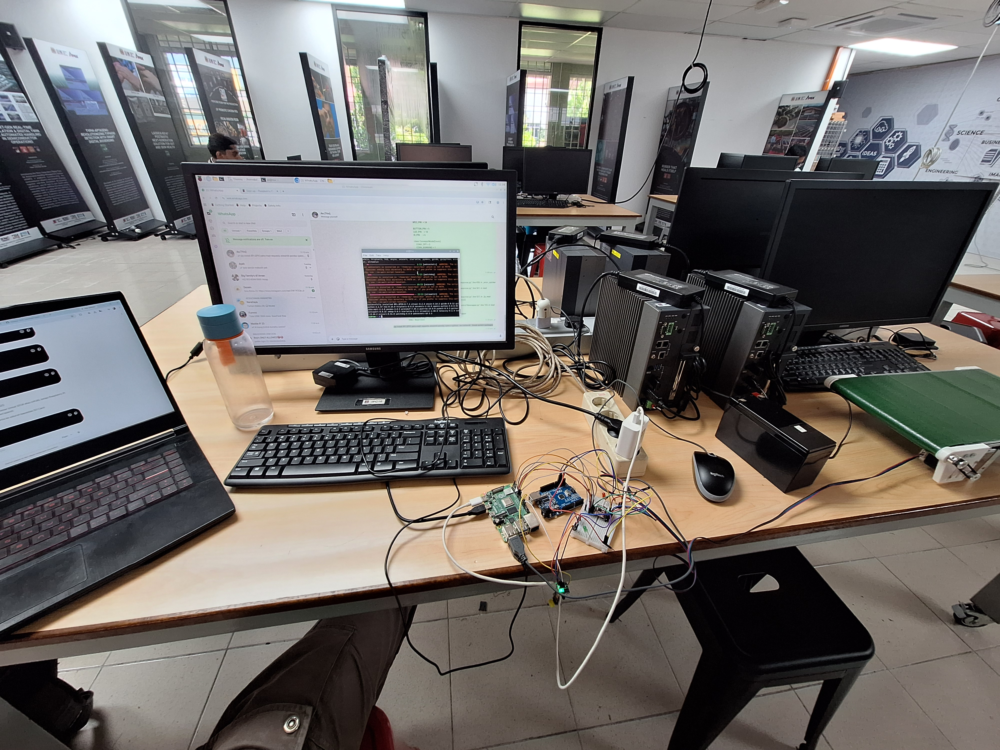
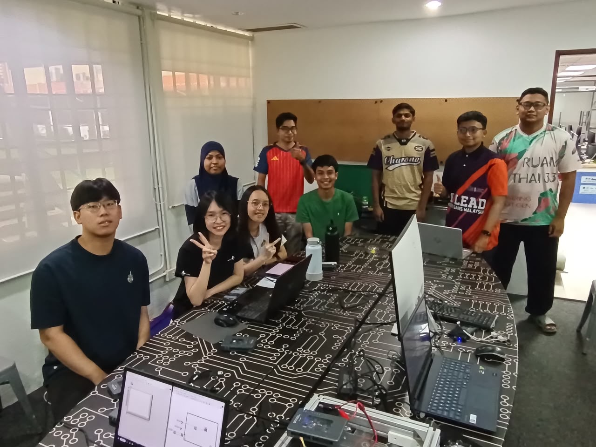

## 📌 Research Internship Overview

**Research Intern – Intelligent Systems & Control**  
*Universiti Sains Malaysia (USM) | July 2026*  
*Supervised by Dr. Azman Ab Malik (Makers Lab)*

* **End-to-End System:** Built an end-to-end semiconductor component completeness detection system integrating a custom YOLO object detection model, automated conveyor belt control, and a real-time web dashboard.
* **Hardware & Software Tools:** Gained hands-on experience in control and system development using LabVIEW for myRIO, AWS Console, and Unity Hub.
* **International Collaboration:** Collaborated with an international team of engineering researchers to design, integrate, and test embedded computer vision solutions.

---

## 🛠️ Technologies & Tools Used

| Category | Tools & Frameworks |
| :--- | :--- |
| **Computer Vision & ML** | YOLO, OpenCV, Python |
| **Control & Embedded Systems** | LabVIEW, NI myRIO, Conveyor Actuators |
| **Cloud & Web Dashboard** | AWS Console, Web Frameworks |
| **Simulation & Platforms** | Unity Hub |

## 📷 System Demonstration

  
   
  <em>Figure 1: Testing the conveyor belt device integrated with a camera (YOLO), sensors, and a UI.</em>

### 🎥 Demonstration Video

Click the image below to watch the full system demonstration on YouTube:

[![System Demo]](https://drive.google.com/file/d/1A9ykroSneKphrMx7M0KVlN8d7EkPBY63/view?usp=drive_link)

## 📷 Hardware Setup

  
   
  <em>Figure 2: Installing the system to Raspberry Pi 4.</em>

## 📷 Lab Team

  
   
  <em>Figure 3: The team at Makers LAB.</em>

